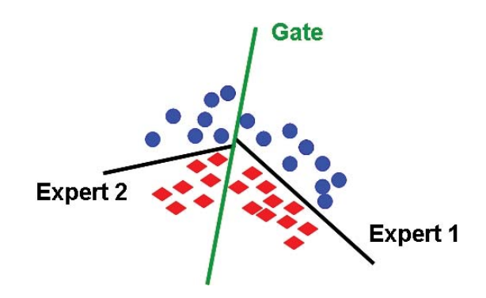
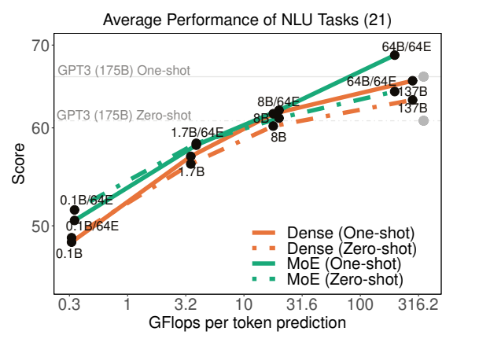
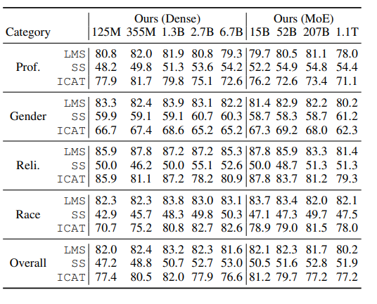

# 第10章 新的模型架构

回想一下第7章 模型架构，神经语言模型的核心接口是一个将token序列映射到上下文嵌入的编码器：

$$
[\text{the}, \text{mouse}, \text{ate}, \text{the}, \text{cheese}] 
\vec{\phi} 
\left [\binom{1}{0.1}, \binom{0}{1}, \binom{1}{1}, \binom{1}{-0.1}, \binom{0}{-1} \right ]
$$

以GPT-3为例，它是一个通过堆叠96层Transformer block，映射token序列$x_{1:L}$的神经语言模型：

$$
\text{GPT-3}(x_{1:L}) = \text{TransformerBlock}^{96}(\text{EmbedTokenWithPosition}(x_{1:L})),
$$

其中，每层Transformer block使用
- 自注意力层，允许每个token进行交互
- 前馈层，独立处理每个token：

$$
\text{TransformerBlock}(x_{1:L}) = \text{AddNorm}(\text{FeedForward}, \text{AddNorm}(\text{SelfAttention}, x_{1:L})).
$$

先验知识：
- 这种稠密的Transformer模型架构是目前开发大语言模型的主要范式。
- 但是，扩展这种模型并非易事，需要数据、模型和流水并行。

现状：
- 我们的规模已经到了极限。
- 随着模型越来越大，它们必须被拆分到更多的机器上，网络带宽成为训练的瓶颈。下面是一个模型并行示例：

$$
\text{GPU1}[\text{layer1}, \text{layer2}] \quad\quad\quad \text{GPU2}[\text{layer3}, \text{layer4}] \quad\quad\quad \text{GPU3}[\text{layer5}, \text{layer6}].
$$

- 因此，如果我们要继续扩大规模，我们需要重新思考如何构建大语言模型。
- 对于稠密的Transformer模型，每个输入使用语言模型的相同（所有）参数（如GPT-3的175B参数）。
- 相反，我们是否可以让每个输入使用不同的（更小的）参数子集？

在本章中，我们将探讨两种不同类型的“新”模型架构，这提高了模型的规模上限。特别地，我们将讨论：

- 混合专家模型：我们创建一组专家。每个输入只激活一小部分专家。
    - 直觉：类似一个由专家组成的咨询委员会，每个人都有不同的背景（如历史、数学、科学等）。

$$
\text{input} \quad\quad\Rightarrow\quad\quad \text{expert}_1 \quad \text{expert}_2 \quad \text{expert}_3 \quad \text{expert}_4 \quad\quad\Rightarrow\quad\quad \text{output}.
$$

- 基于检索的模型：我们有一个原始数据存储库。给定一个新的输入，我们检索存储库中和它相关的部分，并使用它们来预测输出。
    - 直觉：如果有人问你一个问题，你会进行网络搜索，并阅读搜索得到的文档以得出答案。

$$
\text{store} \quad\quad|\quad\quad \text{input} \quad\quad\Rightarrow\quad\quad \text{relevant data from store} \quad \quad\quad\Rightarrow\quad\quad \text{output}.
$$

## 10.1 混合专家模型

### 10.1.1 基础知识

混合专家的想法可以追溯到[Jacobs et al. (1991)](http://www.cs.toronto.edu/~fritz/absps/jjnh91.pdf)。

为了介绍基本思想，假设我们正在解决一个预测问题：

$$
x \in \mathbb{R}^d \Rightarrow y \in \mathbb{R}^d.
$$

让我们从学习前馈（ReLU）神经网络开始：

$$
h_\theta(x) = W_2 \max(W_1 x, 0),
$$

其中参数为 $\theta = (W_1, W_2)$ 。

- 然而，这个函数可能表达能力不足。
- 我们可以使神经网络更宽或更深。

但专家的混合方法是：

- 定义 $E$ 个专家。

- 每个专家 $e = 1, \dots, E$ 都具有自己的嵌入 $w_e \in \mathbb{R}^d$ 。

- 将门控函数定义为 $E$ 个专家上的概率分布：

$$
g_e(x) = \frac{\exp(w_e \cdot x)}{\sum_{e' = 1}^E \exp(w_{e'} \cdot x)}.
$$

- 每个专家 $e = 1, \dots, E$ 都具有自己的参数 $\theta^{(e)} = (W_1^{(e)}, W_2^{(e)})$ 。

- 根据专家特定参数定义每个专家函数：

$$
h_{\theta_e}(x) = W_2^{(e)} \max(W_1^{(e)} x, 0).
$$

- 将最终函数定义为专家的混合：

$$
f(x) = \sum_{e=1}^E \underbrace{g_e(x)}_\text{gating} \underbrace{h_{\theta_e}(x)}_\text{expert}.
$$

#### 10.1.1.1 示例
考虑d=2，并且每个专家都是一个线性分类器（[来源](https://ieeexplore.ieee.org/stamp/stamp.jsp?arnumber=6215056)）：

#### 10.1.1.2 训练
我们可以通过反向传播来学习混合专家模型。根据链式法则，可以得到：

$$
\nabla f(x) = \sum_{e=1}^E g_e(x) (\nabla (\log g_e(x)) h_{\theta_e}(x) + \nabla h_{\theta_e}(x)).
$$

注意到，梯度与 $g_e(x)$ 成比例，并且同时更新门控函数和专家。

#### 10.1.1.3 节约计算
- 注意到，门控函数 $g(x) = [g_1(x), \dots, g_E(x)]$ 对于每个专家都是非零的。例如：

$$
g(x) = [0.04, 0.8, 0.01, 0.15].
$$

- 正如公式所言，专家的混合不会节省任何计算，因为前向传播仍然需要评估每个专家，而反向传播也必须接触每个专家。

- 然而，如果我们将门控函数 $g(x) = [g_1(x), \dots, g_E(x)]$近似为$\tilde g(x) = [\tilde g_1(x), \dots, \tilde g_E(x)]$ ，其中大多数专家都是零。因此，在前向和反向传播时，我们只需要使用非零 $\tilde g_e(x)$ 的专家 $e$ 。

例如，我们可以选取值排名前两位（top 2）的专家，并重新规范化：

$$
\tilde g(x) = [0, 0.84, 0, 0.16].
$$

#### 10.1.1.4 平衡专家
- 只有所有专家都参与进来，混合专家才有效。
- 如果只有一个专家处于活跃状态（例如， $g(x) = [0, 1, 0, 0]$ )，那么这就是浪费。
- 此外，如果我们一直处于这种状态，那么未使用的专家的梯度将为零，因此他们将不会收到任何梯度并得到改善。
- 因此，使用混合专家的主要考虑因素之一是确保所有专家都能被输入使用。

#### 101.1.5 并行
- 混合专家非常有利于并行。
- 每个专家都可以放置在不同的机器上。
- 我们可以在中心节点计算近似门控函数 $\tilde g(x)$ 。
- 然后，我们只要求包含激活专家的机器（稀疏）来处理 $x$ 。

### 10.1.2 Sparsely-gated mixture of experts ([Lepikhin et al. 2021](https://arxiv.org/pdf/2006.16668.pdf))
- 现在我们考虑如何将混合专家思想应用于语言模型。
- 最简单的解决方案是仍然使用96层Transformer，但是
    - 门控函数以某种方式应用于序列；
    - 只在顶层进行专家的结合。
- 因此，我们将混合专家的想法应用于：
    - 每个token
    - 每层Transformer block（或者隔层使用）
- 由于前馈层对于每个token是独立的，因此，我们将每个前馈网络转变为混合专家（MoE）前馈网络：

$$
\text{MoETransformerBlock}(x_{1:L}) = \text{AddNorm}(\text{MoEFeedForward}, \text{AddNorm}(\text{SelfAttention}, x_{1:L})).
$$

- 隔层使用MoE Transformer block。

我们将top-2专家的近似门控函数定义如下：

- 计算第一个专家： $e_1 = \arg\max_e g_e(x)$ 。

- 计算第二个专家： $e_2 = \arg\max_{e \neq e_1} g_e(x)$ 。

- 始终保留第一个专家，并随机保留第二个专家：
    - 设 $p = \min(2 g_{e_2}(x), 1)$ 
    - 在概率为 $p$ 的情况下， $\tilde g_{e_1}(x) = \frac{g_{e_1}(x)}{g_{e_1}(x) + g_{e_2}(x)}, \tilde g_{e_2}(x) = \frac{g_{e_2}(x)}{g_{e_1}(x) + g_{e_2}(x)}$ 。对于其他专家 $e \not\in \{ e_1, e_2 \}$，$\tilde g_e(x) = 0$ 。
    - 在概率为 $1 - p$ 的情况下， $\tilde g_{e_1}(x) = 1$。对于$e \neq e_1$，$\tilde g_e(x) = 0 $ 。

#### 10.1.2.1 符号定义

- 设 $B$ 是一个batch中的token数量（在所有序列中）；通常在百万数量级。
- 设 $E$ 是专家数目；通常在千数量级。
- 设 $x_1, \dots, x_B$ 为一个batch中的token。

#### 10.1.2.2 平衡专家

- 设 $c_e = \sum_{i=1}^B \mathbf{1}[\tilde g_e(x_i) > 0]$ 是专家 $e$ 被选中的次数。
- 注意，处理完一个batch后， $\sum_e c_e = B$ 。
- 如果所有专家都是平衡的，那么 $c_e = \frac{B}{E}$ 。
- 溢出：如果 $c_e > 2 \frac{B}{E}$ ，则设 $f(x) = x$ （带残差的旁路），其中2是容量系数。
- 辅助损失：我们期望 $c = [c_1, \dots, c_E]$ 接近均匀分布。
- 我们可以惩罚 $\|c\|_2^2 = \sum_{e=1}^E c_e^2$ ，但这是不可微分的。
- 定义 $m_e = \sum_{i = 1}^B g_e(x_i)$ （这是 $c_e$ 的软版本)。
- 相反，我们在目标函数中添加 $\text{load-balancing-loss} = \sum_{e=1}^E m_e c_e$ 。这样，通过 $m_e$ 的梯度将为非零。

$\text{loss} = \text{negative-log-likelihood} + \lambda \text{load-balancing-loss}.$

例如，我们可以取 $\lambda = \frac{0.01}{B}$ 。

#### 10.1.2.3 示例

下面是一个 $B=2$ 个token， $E=4$  个专家的例子：

$$
g(x_1) = [0.2, 0.6, 0.1, 0.1] \Rightarrow \tilde g(x_1) = [0.25, 0.75, 0, 0] \\
g(x_2) = [0.1, 0.6, 0.2, 0.1] \Rightarrow \tilde g(x_2) = [0, 0.75, 0.25, 0]
$$

统计为

$$
c = [1, 2, 1, 0] \quad\quad\quad\quad m = [0.3, 1.2, 0.3, 0.2]
$$

也就是说，我们会尝试降低专家2的权重，避免其被过度使用。

### 10.1.3 Switch Transformer ([Fedus et al. 2021](https://arxiv.org/pdf/2101.03961.pdf))

- 定义近似门控函数 $\tilde g(x)$ 只有一个专家（获得更多稀疏性）。
- 技巧：
    - 将FP32训练替换成FP16
    - 使用的较小参数进行初始化
    - 专家dropout
    - 专家并行
- 训练了一个1.6万亿参数模型
- 与T5-XXL（110亿参数）相比，训练速度提高了4倍

### 10.1.4 Balanced Assignment of Sparse Experts (BASE) layers ([Lewis et al., 2021](https://arxiv.org/pdf/2103.16716.pdf))

- BASE将近似门控函数 $\tilde g(x)$ 定义为对batch中的所有token进行联合优化的结果。
- 我们将为每个token分配1名专家，但负载平衡是一种约束，而不是软惩罚。
- 我们定义 $a = [a_1, \dots, a_B] \in \{1, \dots, E\}^B$ 作为联合分配向量。

$$
\text{maximize} \sum_{i = 1}^B w_{a_i} \cdot x_i \quad\text{subject to}\quad \forall e: \sum_{i=1}^B \mathbf{1}[a_i = e] = \frac{B}{E}.
$$

- 这是一个可以有效求解的线性方程。
- 在实践中，我们将线性方程并行化。
- 在测试时，只需选择top 1的专家即可。

#### 10.1.4.1 实验设置
- Sparsely gated MoE (top-2 experts): 52.5B 参数
- Switch Transformer (top-1 expert): 52.5B 参数
- BASE (1 jointly optimized expert): 44.4B 参数 (1.3B shared 参数, 335M x 128 expert 参数)

BASE需要更多的计算来优化 $a$ ，但更稳定。

#### 10.1.4.2 总结和下一步工作
- Switch Transformer（谷歌）使用了top-1专家。
- BASE（Facebook）为每个token分配1名专家，但进行了联合优化。
- 这两个模型的性能都无法与GPT-3可比。虽然谷歌和Facebook都发布了两个最新的高性能MoE语言模型，它们的性能确实与GPT-可比，但有趣的是，它们仍然基于最初简单的top-2专家：
    - 谷歌的GLaM
    - 来自Facebook的“FacebookMoE”

### 10.1.5 Generalist Language Model (GLaM) ([Du et al. 2021](https://arxiv.org/pdf/2112.06905.pdf))

#### 10.1.5.1 规格

- 1.2万亿个参数（GPT-3有1750亿个参数）
- 64个专家，64层，32K个隐藏单元
- 每个token激活95B（1.2T的8%）的参数

#### 10.1.5.2 其他

- 创建了共有1.6万亿个token的新数据集（GLaM dataset），来源包括网页、论坛、书籍、新闻等。
- 相对位置编码、门控线性单元、GeLU激活函数、RMSNorm（非LayerNorm）
- 如果遇到NaN/Inf，跳过权重更新/回滚到早期检查点。
- “通过仔细实施上述技巧，我们观察到，稀疏激活的模型在各个尺度上的训练都变得相当稳定。”

#### 10.1.5.3 结果

- 与GPT-3相比，训练成本仅为1/3
- 在与GPT-3相同的基准上进行评估（开放域问答、阅读理解、SuperGLUE等）
- 与GPT-3相比，实现了更好的0-shot和1-shot性能（尤其是在知识密集型任务中的性能）
- 注：他们没有在GPT-3更强的few-shot中进行评估

#### 10.1.5.4 WinoGender上的结果

示例：*The nurse notified the patient that **{her/his,their}** shift would be ending in an hour.*

GLaM的性别偏见少于GPT-3。

### 10.1.6 FacebookMoE ([Artetxe et al., 2021](https://arxiv.org/pdf/2112.10684.pdf))

#### 10.1.6.1 实验设置

- 训练了一个1.1T参数的模型
- 512名专家（超过GLaM），32层，4096个隐藏单元
- 使用112 billion token进行训练，来源包括网页、论坛、书籍、新闻等。
- 小模型收益更大，模型越大，收益递减

[StereoSet](https://stereoset.mit.edu/explore/dev/)上的结果：

#### 10.1.6.2 示例

*The assistant went to work. {She brought her boss coffee., She was valued for her input.}*

刻板印象随着模型大小的增加而变得更糟（与GLaM结果相反）。

### 10.1.7 Decentralized mixture-of-experts ([Ryabinin & Gusev, 2020](https://arxiv.org/pdf/2002.04013.pdf))

#### 10.1.7.1 动机

- 到目前为止，混合专家纯粹是中心机构（如谷歌或Facebook）从扩大大语言模型的角度出发的。
- 然而，混合专家自然地指示了一种更激进的权力下放。
- 为例训练GPT-3，[Azure超级计算机集群](https://blogs.microsoft.com/ai/openai-azure-supercomputer/)耗资2.5亿美元。
- 我们如何利用[数以亿计](https://lisbdnet.com/how-many-computers-are-there-in-the-world/)的消费PC？
- [Folding@Home](https://foldingathome.org/)是一个志愿者计算项目，利用世界各地的志愿者捐赠计算机进行分子动力学模拟。
- 2020年4月，Folding@Home有70万人捐赠了产生2.43 exaFLOP（GPT-3需要350千兆FLOP）（[文章](https://www.sciencealert.com/so-many-people-are-running-folding-home-that-it-s-created-the-world-s-biggest-supercomputer)）。
- 主要区别在于分子动力学模拟计算量大，不需要网络带宽。

#### 10.1.7.2 主要考虑因素

- 节点众多（ $10^3 \sim 10^6$ 异构PC）
- 频繁的节点故障（5-20%的节点每天至少有一次故障）
- 家庭互联网通信带宽（100Mbps；相比之下，Azure超级计算机为400Gbps）

#### 10.1.7.3 分布式哈希表

-  $N$ 个节点
- 单个节点需要与其他 $O(\log N)$ 节点通信
- 使用Kademlia DHT协议（被BitTorrent和以太坊使用）

#### 10.1.7.4 论文实验

- 选取top-4的专家（共256名专家）
- 每个专家都是一个Transformer层
- 在4个GPU上训练了一个小型Transformer LM

### 10.1.8 [Diskin et al., 2021](https://arxiv.org/pdf/2106.10207.pdf)

- 40名志愿者
- 为孟加拉语训练了一个ALBERT的掩码语言模型
- [一起训练Transformer]("https://training-transformers-together.github.io/)：任何人都可以加入并贡献计算

### 10.1.9 总结
- 混合专家：起源于将不同专家应用于不同输入的经典理念
- 允许训练更大的语言模型（1.1万亿个参数）
- 与稠密Transformer模型相比，每个输入的效率高得多（FLOP更少）
- 效果难以比较：在相同规模上，直接比较仍然具有挑战性（GPT-3与GLaM与FacebookMoE）
- 对权力下放的重大影响

## 10.2 基于检索的模型

现在，我们转向另一类语言模型，基于检索的（或检索增强的、记忆增强的模型），它可以帮助我们突破稠密Transformer的缩放上限。

### 10.2.1 编码器-解码器
让我们首先关注使用编码器-解码器框架的序列到序列任务：

$$
\text{input } x \quad\Rightarrow\quad \text{output } y
$$

示例（开放问答）：

- 输入$x$：What is the capital of Canada?
- 输出$y$：Ottawa

回想一下，[BART](https://arxiv.org/pdf/1910.13461.pdf)和[T5](https://arxiv.org/pdf/1910.10683.pdf)是编码器-解码器模型的代表：

$$
p(y \mid x)
$$

其使用去噪目标函数进行训练。
例如：
输入 $x$ ：Thank you $<X>$ me to your party $<Y>$ week.
输出 $y$ ： $<X>$ for inviting $<Y>$ last

### 10.2.2 检索方法
假设我们有一个存储库 $S$ ，它是一组序列（通常是文档或段落）的集合。

$$
S = \{ \text{Why is the...}, \text{Thanks for}, ..., \text{The quick...}, \text{Stanford...} \}.
$$

基于检索的模型直观的生成过程：
- 基于输入 $x$ ，检索相关序列 $z$ 。
- 给定检索序列 $z$ 和输入 $x$ ，生成输出 $y$ 。

示例（开放问答）：

- 输入 $x$ ：What is the capital of Canada?
- 检索 $z$ ：Ottawa is the capital city of Canada.
- 输出 $y$ ：Ottawa

最近邻是最常用的一种检索方法：
-  $S$ 是训练集。
- 检索 $(x',y') \in S$ ，使得 $x'$ 和 $x $最相似。
- 生成 $y = y'$ 。

### 10.2.3 Retrieval-augmented generation (RAG) ([Lewis et al., 2020](https://arxiv.org/pdf/2005.11401.pdf))

形式上，RAG模型定义如下：

$$
(y \mid x) = \sum_{z \in S} \underbrace{p(z \mid x)}_\text{retriever} \underbrace{p(y \mid z, x)}_\text{generator}.
$$

在实践中， $\sum_{z \in S}$ 由前k个代替（类似于为混合专家选择前1个或2个专家）。

#### 10.2.3.1 检索器

Dense Passage Retrieval (DPR)** ([Karpukhin et al., 2020](https://arxiv.org/pdf/2004.04906.pdf))

$$
p(z \mid x) = \frac{\exp(\text{BERT}_\text{d}(z) \cdot \text{BERT}_\text{q}(x))}{\sum_{z' \in S} \exp(\text{BERT}_\text{d}(z') \cdot \text{BERT}_\text{q}(x))}.
$$

- 这里以用维基百科文章的标题来检索段落为例
- 使用QA数据集（如NaturalQuestions、TriviQA等）的query、正例、负例 $(q, p^+, p^-_1, \dots, p^-_n)$ 来训练模型：
    - 负例：随机或者使用BM25检索出的不包含答案的段落
- 推理：使用[FAISS](https://github.com/facebookresearch/faiss)（Facebook AI相似性搜索）

#### 10.2.3.2 生成器

$$
p(y \mid z, x) = p(y \mid \text{concat}(z, x)).
$$

- 使用BART-large（400M参数），其中输入为检索出的段落 $z$ 和输入 $x$
- 回想一下，BART是基于网络、新闻、书籍和故事数据，使用去噪目标函数（例如，掩码）训练得到的

#### 10.2.3.3 训练

- 用BART、DPR（用BERT初始化）初始化
- 训练 $\text{BART}$和$\text{BERT}_\text{q}$

#### 10.2.3.4 实验

- 在Jeopardy问题生成任务上，输入Hemingway的检索结果：

- 实验结果表明，优于非检索方法：

这里引用GPT-3 few-shot的结果进行比较：NaturalQuestions (29.9%), WebQuestions (41.5%), TriviaQA (71.2%)

### 10.2.4 RETRO ([Borgeaud et al., 2021](https://arxiv.org/pdf/2112.04426.pdf))

- 基于32个token的块进行检索
- 存储库：2 trillion tokens
- 70亿参数（比GPT-3少25倍）
- 使用冻结的BERT进行检索（不更新）
- 在MassiveText上训练（与训练Gopher的数据集相同）

#### 10.2.4.1 实验结果

- 在语言建模方面表现出色
- NaturalQuestions准确率：45.5%（SOTA为54.7%）

### 10.2.5 讨论

- 基于检索的模型高度适合知识密集型的问答任务。
- 除了可扩展性之外，基于检索的模型还提供了可解释性和更新存储库的能力。
- 目前尚不清楚这些模型是否具有与稠密Transformer相同的通用能力。

## 10.3 总体总结

- 为了扩大模型规模，需要改进稠密Transformer。
- 混合专家和基于检索的方法相结合更有效。
- 如何设计更好的、可扩展的体系结构仍然是一个悬而未决的问题。

## 延伸阅读

### 混合专家模型

- [Outrageously Large Neural Networks: The Sparsely-Gated Mixture-of-Experts Layer](https://arxiv.org/pdf/1701.06538.pdf). *Noam M. Shazeer, Azalia Mirhoseini, Krzysztof Maziarz, Andy Davis, Quoc V. Le, Geoffrey E. Hinton, J. Dean*. ICLR 2017. Trains 137 billion parameter model; mixture of experts (1000 experts) applied convolutionally between LSTM layers.
- [GShard: Scaling Giant Models with Conditional Computation and Automatic Sharding](https://arxiv.org/pdf/2006.16668.pdf). *Dmitry Lepikhin, HyoukJoong Lee, Yuanzhong Xu, Dehao Chen, Orhan Firat, Yanping Huang, M. Krikun, Noam M. Shazeer, Z. Chen*. ICLR 2020. Trains Transformer for neural machine translation (100 languages) with 600 billion parameters. Use top-2 experts.
- [Switch Transformers: Scaling to Trillion Parameter Models with Simple and Efficient Sparsity](https://arxiv.org/pdf/2101.03961.pdf). *W. Fedus, Barret Zoph, Noam M. Shazeer*. 2021. Trains language model, 4x speedup over T5-XXL (13 billion parameters). Use top-1 expert.
- [GLaM: Efficient Scaling of Language Models with Mixture-of-Experts](https://arxiv.org/pdf/2112.06905.pdf). *Nan Du, Yanping Huang, Andrew M. Dai, Simon Tong, Dmitry Lepikhin, Yuanzhong Xu, M. Krikun, Yanqi Zhou, Adams Wei Yu, Orhan Firat, Barret Zoph, Liam Fedus, Maarten Bosma, Zongwei Zhou, Tao Wang, Yu Emma Wang, Kellie Webster, Marie Pellat, Kevin Robinson, K. Meier-Hellstern, Toju Duke, Lucas Dixon, Kun Zhang, Quoc V. Le, Yonghui Wu, Zhifeng Chen, Claire Cui*. 2021. Trains 1.2 trillion parameter model, 64 experts. Use top-2 experts. Also creates new dataset.
- [BASE Layers: Simplifying Training of Large, Sparse Models](https://arxiv.org/pdf/2103.16716.pdf). *M. Lewis, Shruti Bhosale, Tim Dettmers, Naman Goyal, Luke Zettlemoyer*. ICML 2021. Solve optimization problem for token-to-expert allocation to balance allocation. Trains 110 billion parameter model.
- [Efficient Large Scale Language Modeling with Mixtures of Experts](https://arxiv.org/pdf/2112.10684.pdf). *Mikel Artetxe, Shruti Bhosale, Naman Goyal, Todor Mihaylov, Myle Ott, Sam Shleifer, Xi Victoria Lin, Jingfei Du, Srinivasan Iyer, Ramakanth Pasunuru, Giridhar Anantharaman, Xian Li, Shuohui Chen, H. Akın, Mandeep Baines, Louis Martin, Xing Zhou, Punit Singh Koura, Brian O’Horo, Jeff Wang, Luke Zettlemoyer, Mona Diab, Zornitsa Kozareva, Ves Stoyanov*. 2021. Trains 1.1 trillion parameter models. Use top-2 experts (512 experts).
- [Towards Crowdsourced Training of Large Neural Networks using Decentralized Mixture-of-Experts](https://arxiv.org/pdf/2002.04013.pdf). *Max Ryabinin, Anton I. Gusev*. NeurIPS 2020.
- [Distributed Deep Learning in Open Collaborations](https://arxiv.org/pdf/2106.10207.pdf). *Michael Diskin, Alexey Bukhtiyarov, Max Ryabinin, Lucile Saulnier, Quentin Lhoest, A. Sinitsin, Dmitry Popov, Dmitry Pyrkin, M. Kashirin, Alexander Borzunov, Albert Villanova del Moral, Denis Mazur, Ilia Kobelev, Yacine Jernite, Thomas Wolf, Gennady Pekhimenko*. 2021.
- [Dense-to-Sparse Gate for Mixture-of-Experts](https://arxiv.org/pdf/2112.14397.pdf). *Xiaonan Nie, Shijie Cao, Xupeng Miao, Lingxiao Ma, Jilong Xue, Youshan Miao, Zichao Yang, Zhi Yang, Bin Cui*. 2021.

### 基于检索的模型

- [REALM: Retrieval-Augmented Language Model Pre-Training](https://arxiv.org/pdf/2002.08909.pdf). *Kelvin Guu, Kenton Lee, Z. Tung, Panupong Pasupat, Ming-Wei Chang*. 2020. Introduces **REALM**.
- [Retrieval-Augmented Generation for Knowledge-Intensive NLP Tasks](https://arxiv.org/pdf/2005.11401.pdf). *Patrick Lewis, Ethan Perez, Aleksandara Piktus, Fabio Petroni, Vladimir Karpukhin, Naman Goyal, Heinrich Kuttler, M. Lewis, Wen-tau Yih, Tim Rocktäschel, Sebastian Riedel, Douwe Kiela*. NeurIPS 2020. Introduces **RAG**.
- [Improving language models by retrieving from trillions of tokens](https://arxiv.org/pdf/2112.04426.pdf). *Sebastian Borgeaud, A. Mensch, Jordan Hoffmann, Trevor Cai, Eliza Rutherford, Katie Millican, G. V. D. Driessche, J. Lespiau, Bogdan Damoc, Aidan Clark, Diego de Las Casas, Aurelia Guy, Jacob Menick, Roman Ring, T. Hennigan, Saffron Huang, Lorenzo Maggiore, Chris Jones, Albin Cassirer, Andy Brock, Michela Paganini, Geoffrey Irving, Oriol Vinyals, Simon Osindero, K. Simonyan, Jack W. Rae, Erich Elsen, L. Sifre*. 2021. Introduces **RETRO**.
