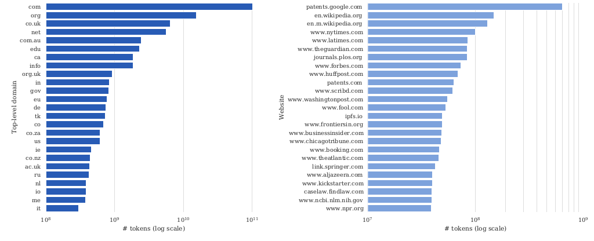

到目前为止，我们已经讨论了大型语言模型的行为（能力和损害）。现在，我们要剥开洋葱的第一层，开始讨论这些模型是如何构建的。任何机器学习方法的起点都是训练数据，因此这就是我们开始的地方。

附录：通常在机器学习中，训练数据和测试（评估）数据是相似的，或者至少是同一类型的。但对于大型语言模型来说，训练数据就是“原始文本”。

## 5.1 大语言模型背后的数据
我们要清楚，大型语言模型是在"原始文本"上进行训练的。为了实现高度的能力（如语言和世界知识），这些文本应涵盖广泛的领域、类型、语言等。

网络是寻找这种文本的自然场所（但不是唯一场所），因此这将是我们主要关注的焦点。网络的体量绝对巨大。作为下限，谷歌的搜索索引就有100PB（参考资料）。实际的网络可能更大，而深网(指的是所有无法被搜索引擎识别的网页)的规模比这还要大。

值得注意的是，大公司中存储的私有数据集甚至比公开可用的数据更大。例如，[沃尔玛](https://www.forbes.com/sites/bernardmarr/2017/01/23/really-big-data-at-walmart-real-time-insights-from-their-40-petabyte-data-cloud)每小时就会产生2.5PB的数据！

[Common Crawl](https://en.wikipedia.org/wiki/Common_Crawl)是一个非营利组织，它对网络进行爬取，并提供免费给公众的快照。由于其便利性，它已经成为许多模型如T5、GPT-3和Gopher的标准数据源。例如，Common Crawl在2021年4月的快照就有320TB的数据，这比谷歌的索引小了好几个数量级。

尽管网络数据丰富，但[Bender等人](https://dl.acm.org/doi/pdf/10.1145/3442188.3445922)在2021年的研究中指出：
- 大规模数据在全球人口中的代表性仍然不均衡。
- 网络数据过多地代表了来自发达国家的年轻用户。
- GPT-2的训练数据基于Reddit，根据皮尤互联网研究的2016年调查，美国Reddit用户中有67%是男性，64%的年龄在18到29岁之间。
- 维基百科的编者中只有8.8-15%是女性。
- 网络上的骚扰可能会让某些人群（如跨性别者、神经发育不同的人）产生排斥感。
- 过滤"不良词汇"可能进一步边缘化某些人群（如LGBT+）。
因此，我们的结论是：理解和记录用于训练大型语言模型的数据集的组成是至关重要的。

### 5.1.1 WebText和OpenWebText数据集

WebText数据集被用于训练GPT-2模型。其目标是获取既多样化又高质量的数据集。以前的研究主要是在新闻、维基百科或小说等数据集上进行训练，而Common Crawl包含了大量的垃圾信息（如无意义文本和模板文本）。[Trinh和Le](https://arxiv.org/pdf/1806.02847.pdf)在2018年根据n-gram与目标任务的重叠性，选择了Common Crawl的一小部分。创建WebText的过程包括：抓取至少获得3个赞的所有外链，过滤掉维基百科以便在基于维基百科的基准测试中进行评估，最终得到了40GB的文本。

尽管OpenAI并没有公开发布WebText数据集，但[OpenWebText数据集](https://skylion007.github.io/OpenWebTextCorpus/)在理念上复制了WebText的构建方法。也就是说，虽然OpenWebText并非OpenAI直接发布的WebText的副本，但它遵循了WebText的制作思路和方法，目的是尽可能地模拟和复现WebText的数据特性和结构。这样，研究者们就可以利用OpenWebText来进行一些原本需要WebText数据集的实验和研究。OpenWebText从[Reddit提交的数据集](https://files.pushshift.io/reddit/submissions/)中提取所有URL，使用Facebook的[fastText](https://github.com/facebookresearch/fastText)过滤掉非英语内容，删除近乎重复的内容，最终得到了38GB的文本。

在2020年的RealToxicityPrompts研究中，[Gehman等人](https://arxiv.org/pdf/2009.11462.pdf)对这两个数据集进行了毒性分析：OpenWebText有2.1%的内容毒性得分>=50%，WebText有4.3%的内容毒性得分>=50%。新闻的可靠性与毒性负相关（Spearman ρ=−0.35），并且OpenWebText中有3%的内容来自被禁止或被隔离的subreddits，如/r/The_Donald和/r/WhiteRights。

### 5.1.2 Colossal Clean Crawled Corpus（C4）

[C4语料库](https://www.tensorflow.org/datasets/catalog/c4)被用来训练T5模型。这个语料库从2019年4月的Common Crawl快照（1.4万亿个标记）开始，移除了“[bad words](https://github.com/LDNOOBW/List-of-Dirty-Naughty-Obscene-and-Otherwise-Bad-Words/blob/master/en)”，移除了代码（“{”），通过langdetect过滤掉了非英语文本，最终得到了806GB的文本（1560亿个标记）。

[Dodge等人](https://arxiv.org/pdf/2104.08758.pdf)在2021年对C4数据集进行了深入分析。分析主要涉及以下几个方面：
- 元数据：来源，话语数据。
- 包含的数据：由机器或人类创作的，社会偏见，数据污染。
- 排除的数据：医疗或健康数据，人口身份。
值得注意的是，[Raffel等人](https://arxiv.org/pdf/1910.10683.pdf)在2020年的研究中只提供了重建脚本；仅运行这些脚本就需要数千美元。而且，令人惊讶的是，大量数据来自patents.google.com。互联网档案中的65%页面都被纳入其中，而在这些页面中，92%的页面是在过去十年内编写的。然而，虽然美国托管的页面占到了51.3%，来自印度的页面数量却相对较少，尽管那里有大量的英语使用者。另外，来自patents.google.com的一些文本是自动生成的，因此可能存在系统性的错误：例如，用外国的官方语言（如日语）提交的专利将自动翻译成英语；另一些则是由光学字符识别（OCR）自动生成的。

### 5.1.3 Benchmark的数据污染问题
当我们评估大型语言模型的能力时，我们常常会使用一些基准数据，例如问题-答案对。然而，若基准数据在模型的训练数据中出现过，基准性能就可能会产生偏差。一般而言，在机器学习中，保证训练数据和测试数据的分离（我们称之为数据卫生）相对容易。但对于大型语言模型，训练数据和基准数据都源自互联网，要事先保证它们的完全分离就显得有些困难。

以[XSum摘要](https://huggingface.co/datasets/xsum)数据集为例，输入的是一段关于一个前阿森纳门将的介绍，而输出则是这位门将被任命为技术主管的新闻，细节如下面的例子。这就存在两种类型的污染。一种是输入和输出污染，即输入和输出都出现在训练数据中，其比例在1.87%至24.88%之间。另一种是只有输入在训练数据中出现，比如来自维基百科的QNLI数据集，这种污染的比例在1.8%至53.6%之间。
```
**Input**: _The 48-year-old former Arsenal goalkeeper played for the Royals for four years. He was appointed youth academy director in 2000 and has been director of football since 2003. A West Brom statement said: “He played a key role in the Championship club twice winning promotion to the Premier League in 2006 and 2012.
**Output**: _West Brom have appointed Nicky Hammond as technical director, ending his 20-year association with Reading._
```

此外，我们还要注意，这种数据污染并不是由于数据集的托管方式导致的，因为数据集通常会以JSON文件的形式存储，而不是网页。

但是，数据集也可能引发多种问题。首先，存在代表性损害的可能，例如，我们发现与特定族群相关的词汇（如"犹太"和"阿拉伯"）与积极情绪词汇的共现频率存在差异，这可能反映了模型的某种偏见。其次，数据集的选择和过滤也可能导致分配损害。以过滤版的Common Crawl（即C4）为例，只有大约10%的内容被保留。然而，涉及性取向的内容更容易被过滤掉，而其中一部分是并无冒犯之意的。某些特定的方言也更容易被过滤，例如非洲裔美国人的英语和西班牙裔的英语，相比之下，白人美国英语的过滤率就要低得多。

### 5.1.4 GPT-3的数据集
![[./images/gpt-3-dataset.png.png]]
GPT-3的数据集主要源自Common Crawl，而Common Crawl又类似于一个参考数据集——WebText。GPT-3下载了41个分片的Common Crawl数据（2016-2019年）。通过训练一个二元分类器来预测WebText与Common Crawl的区别，如果分类器认为文档更接近WebText，那么这个文档就有更大的概率被保留。在处理数据时，GPT-3采用了模糊去重的方法（检测13-gram重叠，如果在少于10个训练文档中出现，则移除窗口或文档），并从基准数据集中移除了数据。此外，GPT-3也扩大了数据来源的多样性（包括WebText2、Books1、Books2以及维基百科）。在训练过程中，Common Crawl被降采样，它在数据集中占82%，但只贡献了60%的数据。

然而，GPT-3也暗示了我们除了网络爬虫之外，也许还可以寻找其他更高质量的数据来源。EleutherAI（一个致力于构建开放语言模型的非营利组织）进一步推动了这个想法。他们发布了一种语言模型的数据集，名为The Pile，其核心理念是从较小的高质量数据源（如学术和专业资源）中获取数据。

### 5.1.5 The Pile数据集
The Pile数据集包含了825GB的英文文本，由22个高质量数据集组成。当用这个数据集训练GPT-2Pile（1.5B参数）并与用GPT-3数据集训练的GPT-3（175B参数）进行比较时，研究者们发现，The Pile包含了大量GPT-3数据集未能很好覆盖的信息。他们还分析了贬损内容、性别/宗教偏见等问题，结果与以前的研究大致相同。
![[./images/pile-dataset.png.png]]
总的来说，网络和私有数据的总量是巨大的，但是简单地将所有数据（甚至是Common Crawl）都用于训练并不能有效地利用计算资源。数据的过滤和策划（如OpenWebText，C4，GPT-3数据集）是必要的，但可能会导致偏见。策划非网络的高质量数据集（如The Pile）是有前途的，但也需要仔细记录和审查这些数据集。

## 5.2 数据集文档
在本文中，我们将深入探讨数据的一般原则，暂时不讨论语言模型数据集的具体内容。长期以来，人们都明白文档记录的重要性，然而在机器学习领域，这个过程往往被处理得较为随意。为了更好地理解这一点，让我们来看一些其他领域的例子：在电子行业中，每个组件都有一份详细的数据表，包含其运行特性、测试结果、推荐使用情况等信息；又如美国食品药品监督管理局要求所有的食品都必须标注营养成分。[Gebru等人](https://arxiv.org/pdf/1803.09010.pdf)在2018年发表的论文深刻影响了这一领域，他们提出了围绕文档的社区规范。[Bender和Friedman](https://aclanthology.org/Q18-1041.pdf)在2018年的论文《数据声明》也提出了一个更适用于语言数据集的框架，这两个工作都在强调透明度。

数据文档的主要目的有两个：一方面，它让数据集的创建者有机会反思他们的决策，以及在创建数据集过程中可能产生的潜在危害，比如社会偏见；另一方面，它让数据集的使用者了解何时可以使用数据集，何时不应使用数据集。

在整个数据集的生命周期中，我们需要考虑很多问题，比如数据集的创建动机，谁是数据集的创建者，数据集的创建是由谁资助的。在数据集的组成部分，我们需要了解数据集中的实例代表什么，是否有缺失信息，是否包含机密数据等。在收集过程中，我们需要了解每个实例的数据是如何获取的，谁参与了数据收集，他们是如何获得报酬的，以及是否进行了道德审查等。在预处理、清理和标记阶段，我们需要了解这些工作是否已经完成，是否有相应的软件可供使用。在数据集的使用方面，我们需要了解数据集是否已经被用于某些任务，是否有不适合使用该数据集的任务。在分发阶段，我们需要了解数据集将如何分发，是否有第三方对数据施加了知识产权或其他的限制。在维护阶段，我们需要了解谁会负责维护数据集，数据集是否会更新。

专门针对自然语言处理（NLP）数据集的工作，比如数据声明，还涵盖了其他方面，例如策划理念，语言多样性，说话人和注释者的人口统计学信息等。以"[The Pile"数据集](https://arxiv.org/pdf/2201.07311.pdf)为例，我们可以更好地理解这些问题。

## 5.3 数据生态
目前为止，我们主要关注了现有大型语言模型数据集的分析以及文档记录，但实际上数据是一个广泛的概念，可以从许多其他角度进行研究。

在数据管理方面，我们在机器学习研究中通常认为数据集是固定的对象，收集起来之后，直接投入到训练算法中。然而在数据库领域，有一整个子领域正在思考数据是如何产生和使用的生态系统，这在工业领域特别相关。

在基础模型报告的数据部分中讨论了[一些问题](https://crfm.stanford.edu/assets/report.pdf#data)。[数据治理](https://en.wikipedia.org/wiki/Data_governance)主要关注一个组织如何创建数据、维护其质量和安全性。Hugging Face发起的BigScience项目旨在收集一个大型多语种数据集并训练一个大型语言模型。[BigScience的数据治理工作组](https://www.youtube.com/watch?v=NL1_kMOkHm8)正在开发一个框架，以负责任地策划高质量的数据源，而不是无差别地爬取网页。
![[./images/data-eco.png.png]]

数据尊严是一个源自微软和RadicalxChange的概念，试图思考数据的本质。人们创造数据，由于人们生活在社会环境中，数据也并不仅仅是个体的财产，而是群体的财产。比如电子邮件、遗传数据。在个体层面上，数据没有价值，但在集体层面上，它具有巨大的价值。相关的有一个为在机器学习的背景下给定数据点赋予价值的框架[Data Shapley](https://arxiv.org/pdf/1904.02868.pdf)。现状是，人们免费放弃他们的数据，大公司从中获取大量的价值和权力。例如，Alice和Bob都是作家。Alice免费提供写作示例，这可以被用来训练可以替代Bob的语言模型。我们应该将数据视为劳动而不是财产权。数据隐私是在个人层面上工作，而这是不够的。有一种提议是数据联盟，这些联盟是介于数据生产者和数据购买者之间的中间组织，它们能够代表数据生产者进行集体谈判。更多详情请[阅读这篇文章](https://www.radicalxchange.org/media/papers/data-freedom-act.pdf)。

## 延伸阅读

Documentation for datasets:

- [Datasheets for datasets](https://arxiv.org/pdf/1803.09010.pdf). _Timnit Gebru, Jamie H. Morgenstern, Briana Vecchione, Jennifer Wortman Vaughan, H. Wallach, Hal Daumé, Kate Crawford_. Communications of the ACM 2018.
- [Data Statements for Natural Language Processing: Toward Mitigating System Bias and Enabling Better Science](https://aclanthology.org/Q18-1041.pdf). _Emily M. Bender and Batya Friedman_. ACL 2018.
- [Model Cards for Model Reporting](https://arxiv.org/pdf/1810.03993.pdf). _Margaret Mitchell, Simone Wu, Andrew Zaldivar, P. Barnes, Lucy Vasserman, B. Hutchinson, Elena Spitzer, Inioluwa Deborah Raji, Timnit Gebru_. FAT 2018.

Datasets:

- [CommonCrawl](http://commoncrawl.org/)
- [OpenWebText](https://skylion007.github.io/OpenWebTextCorpus/) Similar to WebText, used to train GPT-2.
- [Exploring the Limits of Transfer Learning with a Unified Text-to-Text Transformer](https://arxiv.org/pdf/1910.10683.pdf). _Colin Raffel, Noam M. Shazeer, Adam Roberts, Katherine Lee, Sharan Narang, Michael Matena, Yanqi Zhou, W. Li, Peter J. Liu_. J. Mach. Learn. Res. 2019. Introduces **Clossal Clean Crawled Corpus (C4)** and the T5 model.
- [CCNet: Extracting High Quality Monolingual Datasets from Web Crawl Data](https://arxiv.org/pdf/1911.00359.pdf). _Guillaume Wenzek, Marie-Anne Lachaux, A. Conneau, Vishrav Chaudhary, Francisco Guzm’an, Armand Joulin, Edouard Grave_. LREC 2019. Introduces **CCNet**.
- [The Pile: An 800GB Dataset of Diverse Text for Language Modeling](https://arxiv.org/pdf/2101.00027.pdf). _Leo Gao, Stella Rose Biderman, Sid Black, Laurence Golding, Travis Hoppe, Charles Foster, Jason Phang, Horace He, Anish Thite, Noa Nabeshima, Shawn Presser, Connor Leahy_. 2020. Introduces **The Pile**. Introduces **The Pile**, used to train GPT-J.
- [Unsupervised Cross-lingual Representation Learning at Scale](https://arxiv.org/pdf/1911.02116.pdf). _A. Conneau, Kartikay Khandelwal, Naman Goyal, Vishrav Chaudhary, Guillaume Wenzek, Francisco Guzmán, Edouard Grave, Myle Ott, Luke Zettlemoyer, Veselin Stoyanov_. ACL 2019. Introduces cleaned versions of CommonCrawl corpus on 100 datasets, used to train XLM-R.

Analysis of datasets:

- [Documenting Large Webtext Corpora: A Case Study on the Colossal Clean Crawled Corpus](https://arxiv.org/pdf/2104.08758.pdf). _Jesse Dodge, Ana Marasović, Gabriel Ilharco, Dirk Groeneveld, Margaret Mitchell, Matt Gardner_. EMNLP 2021.
- [Quality at a Glance: An Audit of Web-Crawled Multilingual Datasets](https://arxiv.org/pdf/2103.12028.pdf). _Isaac Caswell, Julia Kreutzer, Lisa Wang, Ahsan Wahab, D. Esch, Nasanbayar Ulzii-Orshikh, A. Tapo, Nishant Subramani, A. Sokolov, Claytone Sikasote, Monang Setyawan, S. Sarin, Sokhar Samb, B. Sagot, Clara Rivera, Annette Rios Gonzales, Isabel Papadimitriou, Salomey Osei, Pedro Ortiz Suarez, Iroro Orife, Kelechi Ogueji, Rubungo Andre Niyongabo, Toan Q. Nguyen, Mathias Muller, A. Muller, S. Muhammad, N. Muhammad, Ayanda Mnyakeni, Jamshidbek Mirzakhalov, Tapiwanashe Matangira, Colin Leong, Nze Lawson, Sneha Kudugunta, Yacine Jernite, M. Jenny, Orhan Firat, Bonaventure F. P. Dossou, Sakhile Dlamini, N. D. Silva, Sakine cCabuk Balli, Stella Rose Biderman, A. Battisti, Ahmed Baruwa, Ankur Bapna, P. Baljekar, Israel Abebe Azime, A. Awokoya, Duygu Ataman, Orevaoghene Ahia, Oghenefego Ahia, Sweta Agrawal, Mofetoluwa Adeyemi_. 2021.

Filtering datasets:

- [An Empirical Exploration in Quality Filtering of Text Data](https://arxiv.org/pdf/2109.00698.pdf). _Leo Gao_. 2021.
- [Deduplicating Training Data Makes Language Models Better](https://arxiv.org/pdf/2107.06499.pdf). _Katherine Lee, Daphne Ippolito, Andrew Nystrom, Chiyuan Zhang, D. Eck, Chris Callison-Burch, Nicholas Carlini_. 2021.

Data ecosystems:

- [Foundation models report (data section)](https://crfm.stanford.edu/assets/report.pdf#data)
- [BigScience data governance working group](https://www.youtube.com/watch?v=NL1_kMOkHm8)
- [Data Shapley: Equitable Valuation of Data for Machine Learning](https://arxiv.org/pdf/1904.02868.pdf). _Amirata Ghorbani, James Y. Zou_. ICML 2019.
- [Data Freedom Act](https://www.radicalxchange.org/media/papers/data-freedom-act.pdf)
