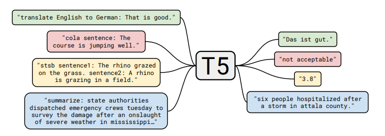
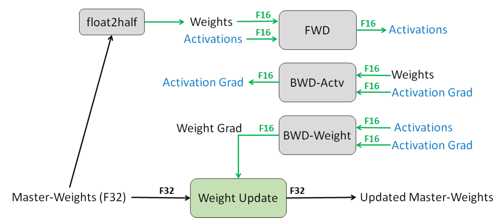

上一章中，我们讨论了大语言模型（例如，Transformer）的模型结构。
在本章中，我们将讨论如何训练大语言模型。
本章分成目标函数和优化算法两部分。

## 8.1 目标函数

我们研究三类语言模型的目标函数：
1. 只包含解码器（Decoder-only）的模型（例如，GPT-3）：计算单向上下文嵌入（contextual embeddings），一次生成一个token
2. 只包含编码器（Encoder-only）的模型（例如，BERT）：计算双向上下文嵌入
3. 编码器解码器（Encoder-decoder）模型（例如，T5）：编码输入，解码输出

我们可以使用任何模型将token序列映射到上下文嵌入中（例如，LSTM、Transformers）：

$$
\phi : V^L \to \mathbb{R}^{d \times L}. 
$$

$$
\left[\text{the}, \text{mouse}, \text{ate}, \text{the}, \text{cheese}\right] \stackrel{\phi}{\Rightarrow} \left[\binom{1}{0.1}, \binom{0}{1}, \binom{1}{1}, \binom{1}{-0.1}, \binom{0}{-1} \right].
$$

### 8.1.1 Decoder-only 模型
回想一下，自回归语言模型定义了一个条件分布：

$$
p(x_i \mid x_{1:i-1}).
$$

我们将其定义如下：
- 将 $x_{1:i-1}$ 映射到上下文嵌入$\phi(x_{1:i-1})$。
- 应用嵌入矩阵 $E \in \R^{V \times d}$ 来获得每个token的得分 $E \phi(x_{1:i-1})_{i-1}$ 。
- 对其进行指数化和归一化，得到预测 $x_i$的 分布。

简洁地：

$$
p(x_{i+1} \mid x_{1:i}) = softmax(E \phi(x_{1:i})_i).
$$

#### 8.1.1.1 最大似然

设 $\theta$ 是大语言模型的所有参数。设 $D$ 是由一组序列组成的训练数据。
然后，我们可以遵循最大似然原理，定义以下负对数似然目标函数：

$$
O(\theta) = \sum_{x \in D} - \log p_\theta(x) = \sum_{x \in D} \sum_{i=1}^L -\log p_\theta(x_i \mid x_{1:i-1}).
$$

并且，有很多的方法可以有效地优化这一目标函数。

### 8.1.2 Encoder-only 模型

#### 8.1.2.1 单向到双向
使用上述最大似然可以训练得到Decoder-only模型，它会产生（单向）上下文嵌入。但如果我们不需要生成，我们可以提供更强的双向上下文嵌入。

#### 8.1.2.2 BERT
我们首先介绍[BERT](https://arxiv.org/pdf/1810.04805.pdf)的目标函数，它包含以下两个部分：
- 掩码语言模型（Masked language modeling）
- 下一句预测（Next sentence prediction）

以自然语言推理（预测隐含、矛盾或中性）任务中的序列为例：

$$
x_{1:L} = [\text{[CLS]}, \text{all}, \text{animals}, \text{breathe}, \text{[SEP]}, \text{cats}, \text{breathe}].
$$

其中有两个特殊的token：
- $\text{[CLS]}$ ：包含用于驱动分类任务的嵌入
- $\text{[SEP]}$ ：用于告诉模型第一个序列（例如，前提）与第二个序列（例如，假设）的位置。

根据上一章的公式，BERT模型定义为：

$$
\text{BERT}(x_{1:L}) = \text{TransformerBlock}^{24}(\text{EmbedTokenWithPosition}(x_{1:L}) + \text{SentenceEmbedding}(x_{1:L})) \in \mathbb{R}^{d \times L},
$$

其中， $\text{SentenceEmbedding}(x_{1:L})$ 根据序列返回以下两个矢量之一
- 对于 $\text{[SEP]}$ 左边的，返回 $e_A \in \mathbb{R}^d$ 
- 对于 $\text{[SEP]}$ 右边的，返回 $e_B \in \mathbb{R}^d$

BERT-large有 $n_\text{heads} = 16$ 个注意头，并且 $d_\text{model} = 1024$ ，总共355M个参数。

##### 8.1.2.2.1 掩码语言模型
掩码语言模型的基本思想是通过加噪然后预测来进行训练：

$$
[\text{the}, \text{[MASK]}, \text{ate}, \text{[MASK]}, \text{cheese}] \Rightarrow [\text{the}, \text{mouse}, \text{ate}, \text{the}, \text{cheese}].
$$

更普遍地说，我们可以将其视为类似于去噪自动编码器，其中我们映射有噪声/不完整版本 $\tilde x_{1:L}$ ，并尝试重建原始 $x_{1:L}$ 。

$$
\tilde x_{1:L} \Rightarrow x_{1:L}.
$$

**建模**：我们首先定义模型分布。给定输入 $\tilde x_{1:L}$ 及其上下文嵌入，模型独立地预测每个token：

$$
p(x_i \mid \tilde x_{1:L}) = \text{softmax}(E \phi(\tilde x_{1:L})_i).
$$

**掩码：** 我们定义了一个（随机）噪声函数 $A(\tilde x_{1:L} \mid x_{1:L})$ ：

$$
\underbrace{x_{1:L}}_\text{original} \stackrel{A}{\Rightarrow} \underbrace{\tilde x_{1:L}}_\text{noised}.
$$

以下是 $A$ 的定义：
- 假设 $I \subset \{1, \dots, L\}$ 代表所有位置中随机的15%。
- 对于每个 $i \in I$ ：
    - 以0.8的概率， $\tilde x_i \leftarrow \text{[MASK]}$ 
    - 以0.1的概率， $\tilde x_i \leftarrow x_i$
    - 以0.1的概率， $\tilde x_i \leftarrow \text{random word from } \mathcal{V}$

**减少分布偏移：** 如果我们总是使用 $\text{[MASK]}$ 来替换 $I$ 中选定的token，则：
- 在训练期间，输入到BERT的都是带 $\text{[MASK]}$ 的序列。
- 而在测试时，我们会输入没有 $\text{[MASK]}$ 的句子，这将导致分布发生变化。一种启发式的解决方法是在20%的时间内用真实单词替换。

##### 8.1.2.2.2 下一句预测
回想一下，BERT是在拼接好的成对句子上训练的。下一句预测的目标是预测第二句是否跟随第一句。

$$
[\text{[CLS]}, \text{the}, \text{mouse}, \text{ate}, \text{the}, \text{cheese}, \text{[SEP]}, \text{it}, \text{was}, \text{full}] \Rightarrow 1.
$$

$$
[\text{[CLS]}, \text{the}, \text{mouse}, \text{ate}, \text{the}, \text{cheese}, \text{[SEP]}, \text{hello}, \text{world}] \Rightarrow 0.
$$

然后使用 $\text{[CLS]}$ 的嵌入来做二分类。

##### 8.1.2.2.3  数据集
$\mathcal{D}$ 是按如下方式构造的一组样本 $(x_{1:L}, c)$ ：
- 令 $A$ 是语料库中的一个句子。
- 以0.5的概率， $B$ 是下一句话。
- 以0.5的概率， $B$ 是语料库中的一个随机句子。
- 令 $x_{1:L} = [\text{[CLS]}, A, \text{[SEP]}, B]$ 
- 令 $c$ 表示 $B$ 是否是下一句。

##### 8.1.2.2.4  训练目标
BERT的训练目标是：

$$
\mathcal{O}(\theta) = \sum_{(x_{1:L},c) \in \mathcal{D}} \underbrace{\mathbb{E}_{I, \tilde x_{1:L} \sim A(\cdot \mid x_{1:L}, I)}[\sum_{i \in I} -\log p_\theta(\tilde x_i \mid x_{1:L})]}_\text{masked language modeling} + \underbrace{-\log p(c \mid \phi(x_{1:L})_1)}_\text{next sentence prediction}.
$$

稍后我们将讨论训练，这里简要总结一下BERT：
- BERT（以及ELMo和ULMFiT）表明，一个统一的体系结构（Transformer）可以用于多个分类任务。
- BERT真正将NLP社区转变为预培训+微调的范式。
- BERT显示了深度双向上下文嵌入的重要性，尽管通过模型大小和微调策略可能会弥补这一点（[p-tuning](https://arxiv.org/pdf/2103.10385.pdf)）。

#### 8.1.2.3 RoBERTa
[RoBERTa](https://arxiv.org/pdf/1907.11692.pdf)对BERT进行了以下改进：
- 删除了下一句预测这一目标函数（发现它没有帮助）。
- 使用更多数据训练（16GB文本  $\Rightarrow$ 160GB文本 ）。
- 训练时间更长。
- RoBERTa在各种基准上显著提高了BERT的准确性（例如，在SQuAD上由81.8到89.4）。

## 8.1.3 Encoder-decoder 模型
任务示例（表格生成文本）：

$$
[\text{name}, \text{:}, \text{Clowns}, \text{|}, \text{eatType}, \text{:}, \text{coffee}, \text{shop}] \mathbb{R}ightarrow [\text{Clowns}, \text{is}, \text{a}, \text{coffee}, \text{shop}].
$$

回想一下编码器-解码器模型（例如，BART、T5）：
- 首先像BERT一样对输入进行双向编码。
- 然后像GPT-2一样对输出进行自回归解码。

#### 8.1.3.1 BART (Bidirectional Auto-Regressive Transformers)
BART ([Lewis et al. 2019](https://arxiv.org/pdf/1910.13461.pdf))是基于Transformer的编码器-解码器模型。

- 使用与RoBERTa相同的编码器架构（12层，隐藏维度1024）。
- 使用与RoBERTa相同的数据进行训练（160GB文本）。

BART使用了以下变换 $A(\tilde x_{1:L} \mid x_{1:L})$ ：

基于BERT的实验，最终模型进行以下了变换：
- 掩码文档中30%的token
- 将所有子句打乱

最后，通过微调，BART在分类和生成任务上都展示了强大的效果。

#### 8.1.3.2  T5 (Text-to-Text Transfer Transformer)
T5 ([Raffel et al., 2020](https://arxiv.org/pdf/1910.10683.pdf))是另一种基于Transformer的编码器-解码器模型。

预训练任务：
给定一段文本，在随机位置将其分割为输入和输出：

$$
[\text{the}, \text{mouse}] \Rightarrow [\text{ate}, \text{the}, \text{cheese}].
$$

论文尝试了许多不同的无监督目标：

并发现“i.i.d. noise, replace spans”效果最好（尽管许多目标相似）。

论文还将所有经典的NLP任务放在一个统一的框架中，称为“Text-to-Text”任务：

以分类任务任务为例，不同模型的差异如下：
- BERT使用 $\text{[CLS]}$ 的嵌入来预测。
- T5、GPT-2、GPT-3等（生成模型）将分类任务转换成自然语言生成。

注意：
- 论文对整个pipline的许多方面（数据集、模型大小、训练目标等）进行了深入研究。
- 基于这些见解，他们训练了一个11B的模型。

# 4.2 优化算法
现在，我们将注意力转向如何优化目标函数。

为了简单起见，让我们以自回归语言模型为例：

$$
O(\theta) = \sum_{x \in D} -\log p_\theta(x).
$$

## 4.2.1 随机梯度下降（SGD）
最简单的优化算法是用小批量进行随机梯度下降，该算法的步骤如下：
- 初始化参数 $\theta_0$ 
- 重复以下步骤：
    - 采样小批量 $B_t \subset D$ 
    - 根据梯度更新参数：
    
    $$
    \theta_t \leftarrow \theta_{t-1} - \eta \frac{1}{|B_t|} \sum_{x \in B_t} \nabla_\theta (-\log p_\theta(x)).
    $$

优化的关键点包括：
1. 我们希望参数 $\theta$ 可以快速收敛
2. 我们希望优化在数值上是稳定的
3. 我们希望内存高效（尤其是对于大模型）

这些点往往相互矛盾（例如，通过低精度训练，可以实现快速收敛、减少内存占用，但是会导致训练不稳定）

因此，我们可以从几个层次来进行优化：
1. 针对经典优化：二阶方法、约束优化等。
2. 针对机器学习：随机方法、隐式正则化+早停法
3. 针对深度学习：初始化、归一化（更改模型架构）
4. 针对大语言模型：由于稳定性问题，学习率和一些直觉（例如，二阶方法）仍然有用，但要使大语言模型有效训练，还需要克服许多其他独特的挑战。不幸的是，其中大部分内容都是特别的，人们对此了解甚少。

## 4.2.2 Adam (adaptive moment estimation)
[Adam](https://arxiv.org/pdf/1412.6980.pdf)算法拥有以下两个创新：
1. 引入动量（继续朝同一方向移动）。
2. 参数 $\theta_0$ 的每个维度都有一个自适应（不同）的步长（受二阶方法启发）。

它的步骤如下：
- 初始化参数 $\theta_0$ 
- 初始化动量 $m_0, v_0 \leftarrow 0$ 
- 重复以下步骤：
    - 采样小批量 $B_t \subset D$ 
    - 按照如下步骤更新参数：
        - 计算梯度
        
        $$
        g_t \leftarrow \frac{1}{|B_t|} \sum_{x \in B_t} \nabla_\theta (-\log p_\theta(x)).
        $$

        - 更新一阶、二阶动量
        
        $$
        m_t \leftarrow \beta_1 m_{t-1} + (1 - \beta_1) g_t \\
        v_t \leftarrow \beta_2 v_{t-1} + (1 - \beta_2) g_t^2
        $$

        - 对偏差进行修正
        
        $$
        \hat m_t \leftarrow m_t / (1 - \beta_1^t) \\
        \hat v_t \leftarrow v_t / (1 - \beta_2^t)
        $$

        - 更新参数
        
        $$
        \theta_t \leftarrow \theta_{t-1} - \eta \, \hat m_t / (\sqrt{\hat v_t} + \epsilon).
        $$

存储占用分析：

Adam将存储从2倍的模型参数（ $\theta_t,g_t$ ）增加到了4倍（ $\theta_t,g_t,m_t,v_t$ ）。

## 4.2.3 AdaFactor
[AdaFactor](https://arxiv.org/pdf/1804.04235.pdf)是一种为减少存储占用的优化算法。它有如下特点：
- 它不储存 $m_t,v_t$ 这样的 $O(m \times n)$ 矩阵，而是存储行和列的和 $O(m + n)$ 并重构矩阵
- 去除动量
- 它被用来训练T5
- AdaFactor可能使训练变得困难（见[Twitter thread](https://twitter.com/_arohan_/status/1468673364889726985?s=20&amp;t=i7E0NN5ytysukMGVWG7lfQ)和[blog post](https://blog.ceshine.net/post/adafactor/)）

## 4.2.4 混合精度训练

[混合精度训练](https://arxiv.org/pdf/1710.03740.pdf)是另一种减少存储的方法
- 通常来说，默认的精度是：FP32（32位浮点）
- 其他可选精度：FP16（16位浮点），但问题是任何小于 $2^{-24}$ 的值都会变为0。
- 解决方案：将主权重存储在FP32中，并在FP16中执行其他所有操作。
- 损失缩放：按比例放大损失，以避免梯度数值太小。
- 结果：存储减少了一半。

## 4.2.5 学习率
- 通常情况下，学习率会随着时间的推移而衰减。
- 对于Transformer模型，我们实际上需要通过预热（warmup）提高学习率。
- [Huang et al., 2020](https://www.cs.toronto.edu/~mvolkovs/ICML22020_tfixup.pdf)表明，一个潜在的原因是防止层归一化的梯度消失，导致使用Adam优化器训练时不稳定。

## 4.2.6 初始化
- 给定矩阵 $W \in \mathbb{R}^{m \times n}$ ，标准初始化（即，xavier初始化）为 $W_{ij} \sim N(0, 1/n)$ 。
- GPT-2和GPT-3通过额外的 $1/\sqrt{N}$ 缩放权重，其中 $N$ 是残差层的数量。
- T5将注意力矩阵增加一个 $1/\sqrt{d}$ ([代码](https://github.com/tensorflow/mesh/blob/master/mesh_tensorflow/transformer/attention.py#L459)）。

以GPT-3为例，使用的参数如下：
- Adam参数： $\beta_1 = 0.9, \beta_2 = 0.95, \epsilon = 10^{-8}$ 
- 批量小：320万个token（约1500个序列）
- 使用梯度剪裁（ $g_t \leftarrow g_t / \min(1, \|g\|_2)$ ）
- 线性学习率预热（前3.75亿个token）
- [余弦学习率](https://arxiv.org/pdf/1608.03983v5.pdf)衰减到10%
- 逐渐增加批大小
- 权重衰减设为0.1

## 延伸阅读
- [混合精度训练](https://lilianweng.github.io/lil-log/2021/09/24/train-large-neural-networks.html#mixed-precision-training)
- [Fixing Weight Decay Regularization in Adam](https://arxiv.org/pdf/1711.05101.pdf). I. Loshchilov, F. Hutter. 2017. 介绍了AdamW
- [ELECTRA: Pre-training Text Encoders as Discriminators Rather Than Generators](https://arxiv.org/pdf/2003.10555.pdf). Kevin Clark, Minh-Thang Luong, Quoc V. Le, Christopher D. Manning. ICLR 2020.
- [DeBERTa: Decoding-enhanced BERT with Disentangled Attention](https://arxiv.org/pdf/2006.03654.pdf). Pengcheng He, Xiaodong Liu, Jianfeng Gao, Weizhu Chen. ICLR 2020.
